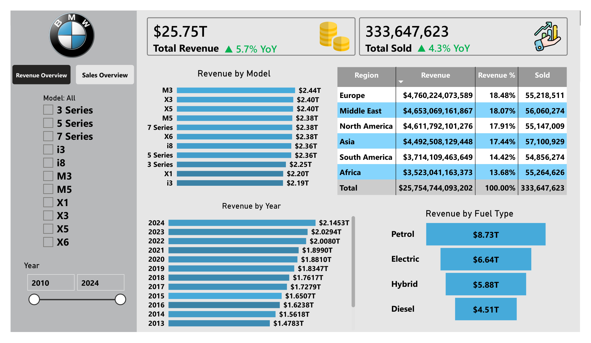
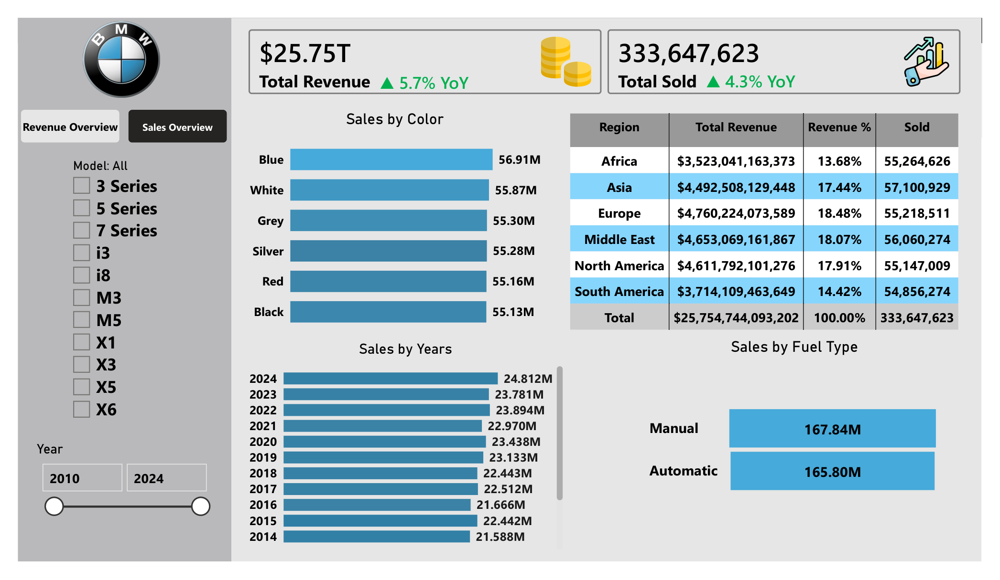

# powerbi-bmw_sales_data-analysis
Analyze BMW sales and their revenue performance across the world

## Dataset
- [bmw_sales.csv](dataset/bmw_sales_data_2010_2024.csv)

## KPIs
- Total Revenue
- Total Sold
- YOY

## Slicers
 - Model
 - Year
 
## Tools Used
- Power BI
- DAX
- Excel / CSV

## Dashboard

### Revenue Overview

### Sales Overview

